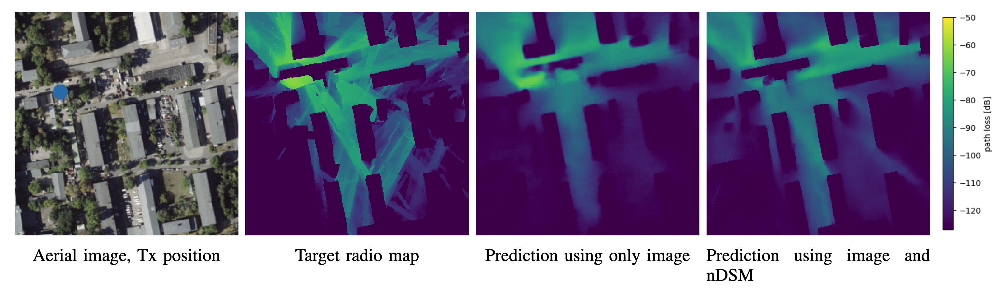

# Radio Map Prediction from Images and Application to Coverage Optimization

This is the official implementation of our experiments on learning radio map estimation from images and optionally additional unclassified height maps with CNNs, described in "Radio Map Prediction from Images and Application to Coverage Optimization". Note that this is an updated version of our repo [RML](https://github.com/fabja19/RML) with the focus shifted to the prediction from images and an additional new application to network optimization ([notebook](coverage_optimization.ipynb)). 



## Requirements

The dataset can be downloaded from [here](https://zenodo.org/uploads/10210089) and is expected to be unpacked to the directory *./dataset*.

To install the required packages via conda run:

```
conda env create -f conda_env/env_complete.yml
```

The environment has been used on Linux computers with CUDA 11.8 and A100 GPUs. On different OS/hardware, you may need to use the less restrictive file [conda_env/env_short.yml](conda_env/env_short.yml) or adjust some packages.

## Basic Usage

To replicate the experiments from the paper, run this command:

```
python main_cli.py fit --model=<model name> --config=<path to config>
```

Here, ```<model name>``` can be any of  _LitRadioUNet, LitPMNet_ or _LitUNetDCN_ and the configs for the dataset class corresponding to our experiments can be found in  the directory [configs/data](configs/data). The training procedure will save the results including a model checkpoint, log file, config and Tensorboard log in a subdirectory of [./logs](./logs).

Instead of training from scratch, you can [download](https://zenodo.org/uploads/10210089) the checkpoints and configs for some of the trained models. The checkpoints for this updated version are contained in *model_checkpoints_v2_img.zip*.

Trained models can be evaluated on the test set by running

```
python main_cli.py test --config=<path to config> --ckpt_path=<path to checkpoint> --trainer.logger.sub_dir=test
```

and inference on the test set is possible with:

```
python main_cli.py predict --config=<path to config> --ckpt_path=<path to checkpoint> --trainer.logger.sub_dir=predict
```

## More options

Arguments for the dataset class (inputs for the model) and hyperparameters of the models and the training procedure can be set with flags. To get an overview of all possible commands, run:

```
python main_cli.py fit --help
python main_cli.py fit --model.help <model class>
python main_cli.py fit --data.help LitRM_directional
```

More information can be found in the documentation of [PyTorch Lightning](https://lightning.ai/docs/pytorch/stable/) and in particular the [CLI](https://lightning.ai/docs/pytorch/stable/cli/lightning_cli.html#lightning-cli).

